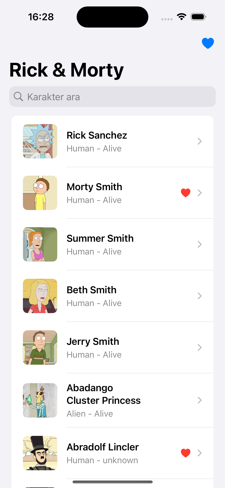
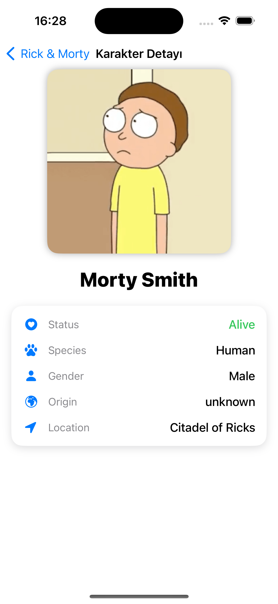
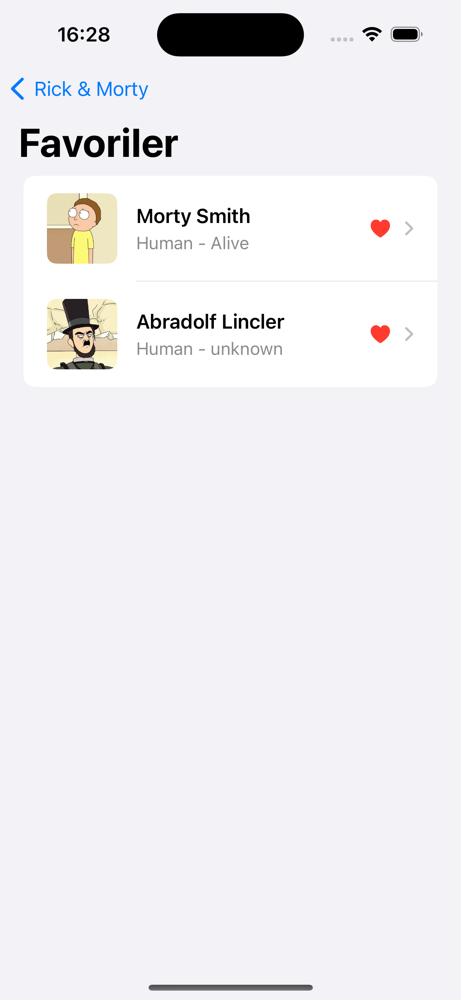

# 📱 API Explorer — Rick & Morty SwiftUI Uygulaması

Bu proje, Rick and Morty API(https://rickandmortyapi.com/documentation/?utm_source=chatgpt.com)
 kullanılarak geliştirilmiş bir SwiftUI uygulamasıdır.
Kullanıcılar karakterleri listeleyebilir, detaylarını görüntüleyebilir ve favorilere ekleyebilir. Uygulama MVVM mimarisi ile yazılmıştır.

## 🚀 Özellikler
- Karakter listesi (arama özelliğiyle birlikte)
- Karakter detay sayfası (status, species, gender, origin, location)
- Favorilere ekleme / favorilerden kaldırma
- Sonsuz kaydırma ile daha fazla karakter yükleme
- Pull to refresh (yenileme)

## 🛠️ Kullanılan Teknolojiler
- SwiftUI → Arayüz geliştirme
- MVVM Mimari → Katmanlı ve test edilebilir yapı
- Async/Await → Asenkron API çağrıları
- Kingfisher → Resim yükleme ve önbellekleme

## 🧪 Testler
- CharacterListViewModelTests → Listeleme ve arama senaryoları
- CharacterDetailViewModelTests → Detay ekranı veri çekme senaryoları
- Mock servis ile network bağımlılığı kaldırılarak test edilebilirlik sağlandı.

## Proje Mimarisi (MVVM)
Bootcamp_Odevi_11/

- Models/              → API modelleri (Character, APIResponse)
- ViewModels/          → İş mantığı ve veri yönetimi
- Views/               → SwiftUI ekranları (List, Detail, Favorites, ErrorView)
- Network/             → NetworkService + API çağrıları
- Managers/            → FavoritesManager (UserDefaults yönetimi)
- Tests/               → Unit test & Mock servisler
- README.md            → Proje açıklamaları

## 📸 Ekran Görüntüleri

Ana Ekran:  

Detay Ekranı:  

Favoriler Ekranı:  

